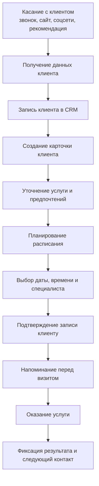
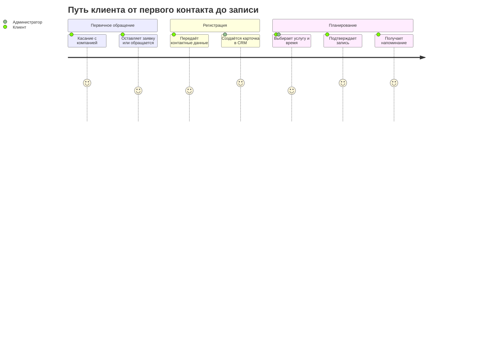
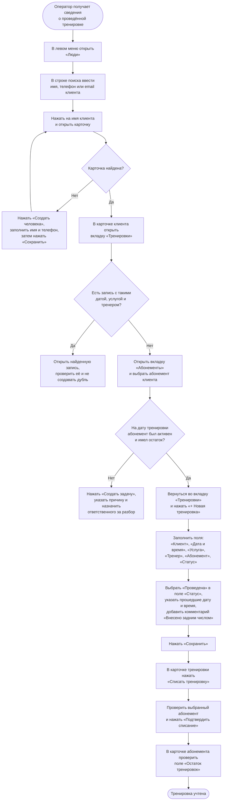

# Пользовательский путь клиента

## От первого касания до последующего контакта

## Путь клиента по этапам

## Флоу записи на тренировку

### Данные, которые нужно фиксировать в CRM

- Клиент: имя, телефон, email, предпочтительный канал связи.
- Тренировка: услуга, формат, длительность, тренер, локация, дата и время.
- Статус: ожидает подтверждения, подтверждена, отменена, проведена или неявка.
- Оплата: абонемент, остаток тренировок, стоимость разового посещения и статус оплаты.
- Коммуникации: отправленные подтверждения, напоминания, причины отмены и результат тренировки.

## Внесение прошедшей тренировки для списания

В этой инструкции используются названия разделов CRM: **Люди**, **Тренировки** и **Абонементы**. Если в настроенной CRM объект или поле называется иначе, его нужно переименовать в инструкции после настройки.

### Что нажимать: пошагово

1. В левом меню откройте **Люди**.
2. В верхней строке поиска найдите клиента по имени, телефону или email и нажмите на его имя.
3. Если человека нет, нажмите **Создать человека**, заполните минимум **Имя** и **Телефон**, затем нажмите **Сохранить**.
4. В карточке клиента откройте вкладку **Тренировки**. Проверьте, нет ли уже тренировки с той же датой, услугой и тренером.
5. Откройте вкладку **Абонементы** и выберите абонемент, который действовал в день тренировки. Проверьте его статус и остаток тренировок.
6. Вернитесь во вкладку **Тренировки** и нажмите **+ Новая тренировка**.
7. В форме выберите или заполните: **Клиент**, **Дата и время**, **Услуга**, **Тренер**, **Абонемент** и **Статус**.
8. Укажите фактические дату и время в прошлом, в поле **Статус** выберите **Проведена**, а в поле **Комментарий** напишите: «Внесено задним числом» и источник сведений.
9. Нажмите **Сохранить**. В открывшейся карточке тренировки нажмите **Списать тренировку**.
10. Проверьте абонемент в окне списания и нажмите **Подтвердить списание**. Затем в карточке абонемента проверьте поле **Остаток тренировок**.

### Когда не создавать тренировку

- Дата и время тренировки должны быть в прошлом; CRM не должна создавать новую будущую запись вместо проведённой.
- Проверять нужно историческое состояние абонемента: был ли он активен и имел ли остаток на дату проведения тренировки.
- Перед созданием обязательна проверка дубля по клиенту, дате, услуге и тренеру.
- При отсутствии подходящего абонемента или оплаты нажмите **Создать задачу**, укажите причину и назначьте ответственного; не списывайте тренировку самостоятельно.
- В записи остаётся источник сведений и данные оператора, чтобы можно было восстановить причину списания.

### Правила, которые стоит согласовать

- Как долго слот остаётся в резерве до подтверждения.
- За какое время клиент может отменить или перенести тренировку без списания.
- Что происходит при неявке и при отмене тренером.
- Кто и через какой канал получает уведомления об изменении записи.
