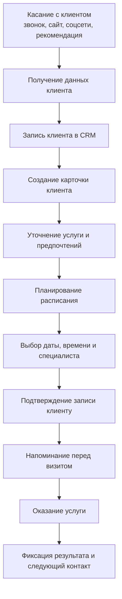
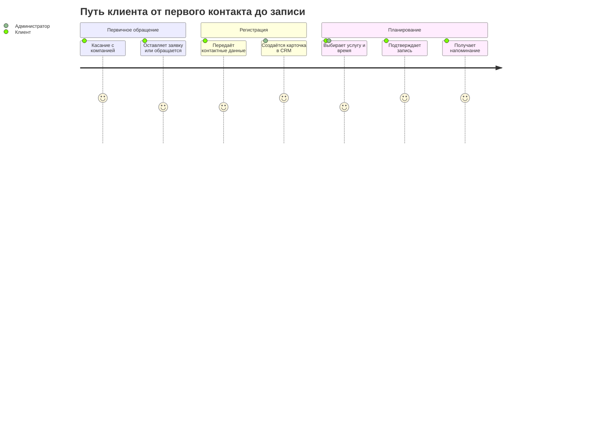
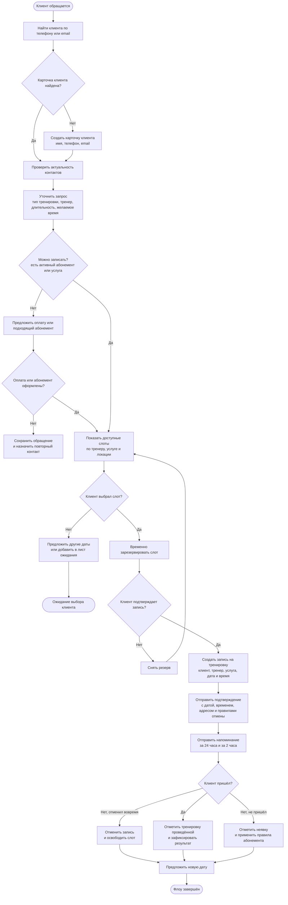
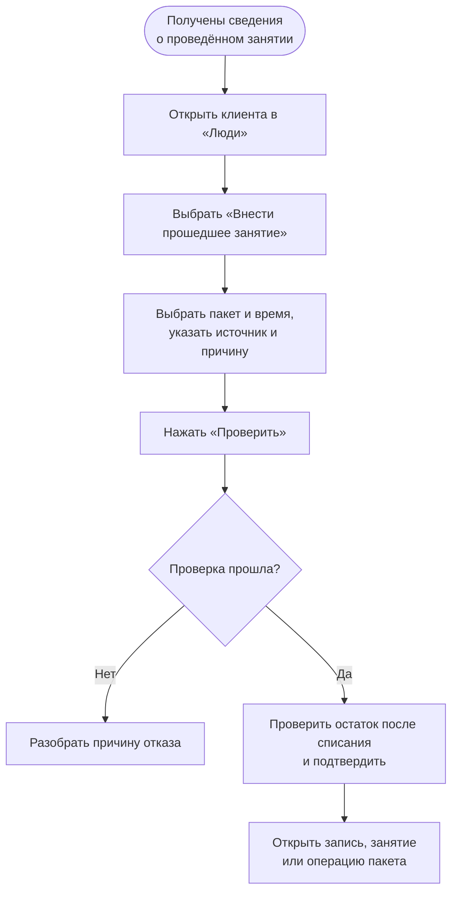

# Пользовательский путь клиента

## От первого касания до последующего контакта

## Путь клиента по этапам

## Флоу записи на тренировку

### Данные, которые нужно фиксировать в CRM

- Клиент: имя, телефон, email, предпочтительный канал связи.
- Тренировка: услуга, формат, длительность, тренер, локация, дата и время.
- Статус: ожидает подтверждения, подтверждена, отменена, проведена или неявка.
- Оплата: абонемент, остаток тренировок, стоимость разового посещения и статус оплаты.
- Коммуникации: отправленные подтверждения, напоминания, причины отмены и результат тренировки.

## Внесение прошедшей тренировки для списания

Оператор вносит состоявшееся занятие из карточки клиента. Пакет клиента должен быть заранее оформлен через команду **Оформить оплату пакета**.

### Что нажимать: пошагово

1. В левом меню откройте **Люди**.
2. В верхней строке поиска найдите клиента по имени, телефону или email и нажмите на его имя.
3. Если клиента нет, создайте его в **Люди**.
4. В карточке клиента выберите команду **Внести прошедшее занятие**.
5. Выберите оплаченный **Пакет клиента** и введите фактическое начало. Окончание система рассчитает по длительности продукта. При наличии подходящего **Занятия** выберите его; иначе команда создаст новое.
6. Выберите источник сведений и введите причину заднего внесения. Для источника **Другое** добавьте пояснение.
7. Нажмите **Проверить**. При отказе разберите указанную причину; команда не должна списывать посещение.
8. Проверьте пакет, дату и остаток после списания, затем нажмите **Подтвердить списание**.
9. Откройте созданную **Запись**, **Занятие** или **Операцию пакета** из результата. Остаток виден в **Пакете клиента**.

### Когда операция отклоняется

- Начало и окончание занятия должны быть в прошлом, после активации выбранного пакета и в пределах его срока действия.
- Пакет должен принадлежать клиенту, быть оформлен через оплату и иметь доступное посещение сейчас и на дату занятия по журналу операций.
- Активная или посещённая запись клиента на то же время считается дублем.
- При отсутствии пакета, несовпадении журнала и остатка или другом отказе передайте случай на разбор. Не меняйте счётчики пакета вручную.

### Правила, которые стоит согласовать

- Как долго слот остаётся в резерве до подтверждения.
- За какое время клиент может отменить или перенести тренировку без списания.
- Что происходит при неявке и при отмене тренером.
- Кто и через какой канал получает уведомления об изменении записи.
