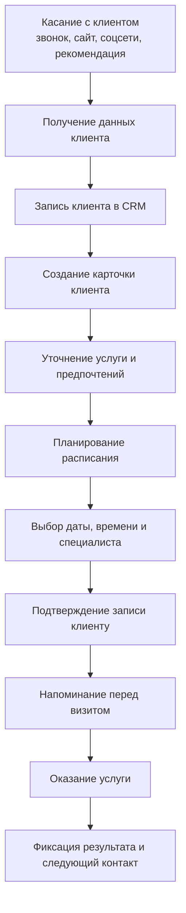
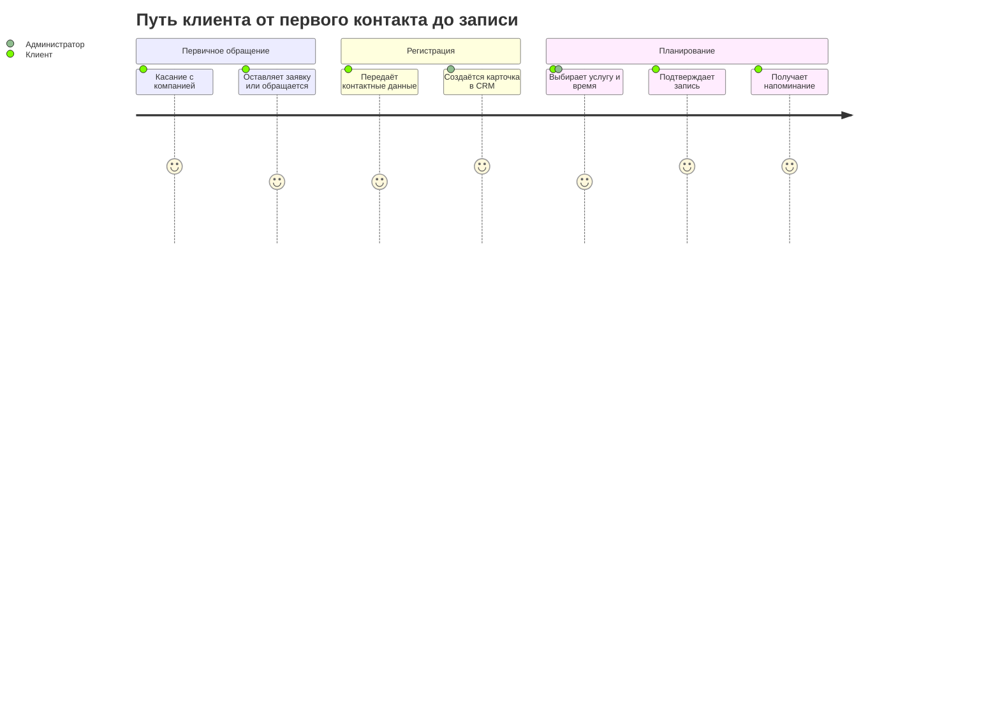
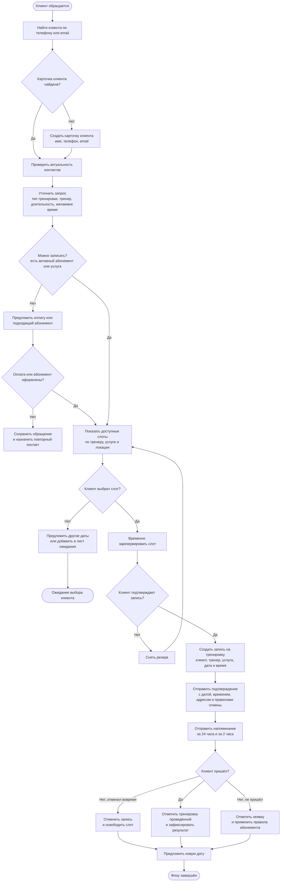

# Пользовательский путь клиента

## От первого касания до последующего контакта

## Путь клиента по этапам

## Флоу записи на тренировку

### Данные, которые нужно фиксировать в CRM

- Клиент: имя, телефон, email, предпочтительный канал связи.
- Тренировка: услуга, формат, длительность, тренер, локация, дата и время.
- Статус: ожидает подтверждения, подтверждена, отменена, проведена или неявка.
- Оплата: абонемент, остаток тренировок, стоимость разового посещения и статус оплаты.
- Коммуникации: отправленные подтверждения, напоминания, причины отмены и результат тренировки.

### Правила, которые стоит согласовать

- Как долго слот остаётся в резерве до подтверждения.
- За какое время клиент может отменить или перенести тренировку без списания.
- Что происходит при неявке и при отмене тренером.
- Кто и через какой канал получает уведомления об изменении записи.
